# Introduction

My university advertises well its study abroad program. In the spring of 2024, fliers about the impending application deadline were posted everywhere in the engineering center. They reminded me of my high school French teacher, who demanded that I study abroad in a francophone land someday. Knowing that this would be my last opportunity before graduation. I buried myself in paperwork and scrambled to file papers for Rennes, the capital of Breton France, as part of the CIEE foreign language program.

The result of this successful effort was that between May 18th and August 10th of 2024,  I went to Europe and lived outside the United States longer than I ever have before. After studying for two months in Rennes, I spent an exciting but at times grueling month winding southward through France and Italy. This is a rough record of what I saw and did. It is also a collection of firsthand cultural observations from an American perspective. Finally, it’s a review for those are interested in studying abroad (especially with CIEE) or European travel in general.

This is a *long* article and not everything will interest everyone, so here’s a table of contents with links. Feel free to leapfrog between the sections that draw you.

* Introduction
* <a href="#study-abroad-program-ciee">The Study Abroad Program, CIEE</a>
    * <a href="#curriculum">Curriculum</a>
* <a href="#france-and-bretagne">France and Bretagne</a>
    * <a href="#the-good">The Good</a>
        * <a href="#food">Food</a>
            * <a href="#boulangeries">Boulangeries</a>
        * <a href="#built-for-people-not-cars">Built for People, Not cars</a>
        * <a href="#fashion">Fashion</a>
        * <a href="#la-culture-litteraire">La Culture Littéraire</a>
        * <a href="#art">Art</a>
        * <a href="#la-politique-sociale">La Politique Sociale</a>
        * <a href="#being-ecolo">Being Écolo</a>
    * <a href="#the-neutral">The Neutral</a>
        * <a href="#the-2024-elections">The 2024 Elections</a>
        * <a href="#the-french-language">The French Language</a>
            * <a href="#african-french">African French</a>
    * <a href="#the-bad">The Bad</a>
        * <a href="#pop-culture">Pop Culture</a>
        * <a href="#smoking">Smoking</a>
        * <a href="#dirt">Dirt</a>
        * <a href="#graffiti">Graffiti</a>
        * <a href="#crowds">Crowds</a>
* <a href="#wandering">Wandering</a>
    * <a href="#centre-val-de-loire">Centre-Val de Loire</a>
        * <a href="#angers">Angers</a>
        * <a href="#saumur">Saumur</a>
        * <a href="#tours-amboise">Tours & Amboise</a>
    * <a href="#paris">Paris</a>
    * <a href="#marseilles">Marseilles</a>
    * <a href="#culture-of-international-hostel">The Culture of the International Hostel</a>
    * <a href="#italy">Italy</a>
        * <a href="#milan">Milan</a>
        * <a href="#florence">Florence</a>
        * <a href="#rome">Rome</a>
            * <a href="#the-vatican">The Vatican</a>
        * <a href="#naples">Naples</a>
    * <a href="#the-louvre">The Louvre</a>
* <a href="#the-ecstatic-return">The Ecstatic Return</a>
* <a href="#conclusion">Conclusion</a>

Besides learning French, there was the typical curiosity about the “Old Continent.”  To those who look behind the thick touristic veneer and layers of stories and fables, there is a grungy, edgy, tense, diverse, beautiful, and deeply human interior. That is the Real Europe today.

I was incredibly lucky and privileged to be able to go on such a trip. Most people in the world still don’t have the income  necessary to travel this long, or at all. I asked many Europeans if they had ever traveled to America: only about half of them had, and even then, it was often just to New York. That being said, we live in a relative golden age of travel accessibility: tourism has never been so [common](https://apnews.com/article/anti-tourism-barcelona-summer-travel-airbnb-df764ed1c7009fdbbf5a32eaedc6ffd5), [widespread, or cheap](https://web.archive.org/web/20171215184653/http://darinlee.net/pdfs/airline_competition.pdf).

# The Study Abroad Program, CIEE

How do you round up a herd of barely-adults in a country where the drinking age is three years younger and get them to learn a foreign language? This is the daunting task that CIEE faces. Collaboration with the home institutions is the first strategy, as the grades CIEE gives out hold weight back home. The core strategy, however, is to offer a worthwhile education.
The program took place in two settings: the classroom and the homestay. The classroom was the language and communication center in central Rennes, a former boy’s school built in 1888 in a courtyard quietly set aside from the rest of the bustling downtown. During breaks we enjoyed the beautiful late-19th century façade on one side along with the ugly 20th century concrete overhang on the other, a clash so very European.

<figure>

<figcaption>The schoolbuilding is shared by the Language and Communication Center and the Centre Franco-Allemand</figcaption>
</figure>

The education is better than American high school French education, and while that’s not a high bar, the lessons were genuinely helpful. Classes were taught in French and revolved around the three competencies of grammar, written comprehension, and oral comprehension. Grammar topics taught included the subjunctive, adjective agreement with the compound past tense, and the conditional: typical topics for an intermediate and advanced classes. For written comprehension, we read articles published in the last 15 years and answered questions about them. Each week there was a topic to write an essay about that matched the theme. For oral comprehension, the teacher would bring out a speaker, fiddle with the plug for a few moments, and then play an interview, radio show, or newscast. We asked and answered questions about the audio, and sometimes got a second or third lesson to pick out the words we missed. It should be noticed that everything in this education is very *functional*, in that we read and wrote content relevant to daily life in the present. This stands in contrast to how French is taught back home. Americans see French as a cultural feather in your cap, pretty but useless, and the content we analyze in our French classes analyze is tailored to that expectation. This is a good contrast, and the difference in curriculum here fits the setting.

## Curriculum

The homestay was the highlight of the program. Students are assigned to one of several *familles d’accueil* who have signed up to take the student in and keep them in the family for a small fee. Students talk with them, do activities with them, and (most importantly) eat with them.

I loved my homestay. I won’t say too much to protect their privacy. They were a couple experienced with homestays. Communication, all in French, wasn’t easy but got easier over time as I learned common words and phrases and got used to French *as it is really spoken*. This knowledge of the language as it’s used, which can be gained only in the field, is the most precious part of the study abroad experience. Their habits are more ecologically friendly than those of Americans (more on that later), and everything about French cuisine is much better. In a typical French dinner, no food is ever wasted, while at the same time no one eats more than they like.

# France

## France and Bretange

<figure>
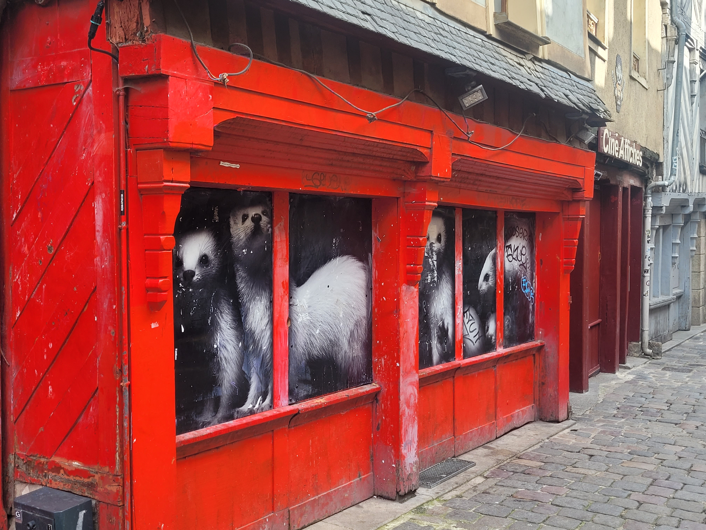
<figcaption>The ermine, a type of cute white ferret, is the symbol of Bretagne</figcaption>
</figure>

France is a land of opposites. The French try to avoid mediocrity in everything, but it can be hard to predict which direction they will veer off to to avoid the middle. France is:

1. Both culturally near to and far from America
1. Both highly orderly and highly chaotic
1. Both politically very left-wing and culturally rather conservative
1. Both consciously beautiful and consciously ugly

What unites France is its sense of cultural distinction. It is the cultural figurehead of the European Union, and after Germany, its most important member. The French people still believe in Charles de Gaulle’s words: *Bref, à mon sens, la France ne peut être la France sans la grandeur.* Nowhere was this more obvious than in the pomp and circumstance surrounding the Olympic games, which the whole of France was decorated for. It is impossible to visit France without sensing a strong gratefulness that its unparalleled cultural heritage has passed down, through so many reversals and disasters, to this modern day. There is a wide diversity in this cultural heritage, which runs from the cloudy green beaches of *la côte d’émeraud* to the mediterranean sands of *la côte d’azur*, which ranges from prehistoric megaliths to modernist university buildings. Throughout all this diversity, there is a constant sense of that *grandeur* that De Gaulle described. France is the jewel of Europe.

## The Good:

### The Food

Knowing as a factoid that the French are culinary experts is one thing, but actually sitting down on a French table, enjoying three or so courses, and experiencing the amazing taste, flavor, and presentation of each dish is another thing entirely. Among the many cultural achievements of France, cuisine sits the highest. The first dish I had in Bretagne, *la galette*, which is a sort of thin pancake with all sorts of yummy cheeses and meats stuffed inside. The portions are reasonably-size, which is a good respite for someone used to American food.

Europeans enjoy drinking sparkling water, and this is a habit every American should take up as it is much healthier than soda. 

The French are *far* more detailed and particular about food than most Americans. I was struck by this was when I bought some apples from the grocery store and told my homestay family about it: they asked me, “will they be any good? Apples aren’t in season right now.” In America, I’ve never thought about whether produce is in “season” when I’m buying it, unless it’s not available at all (which is rare), and I have never thought about how that would effect how good the fruit is. 

<figure>
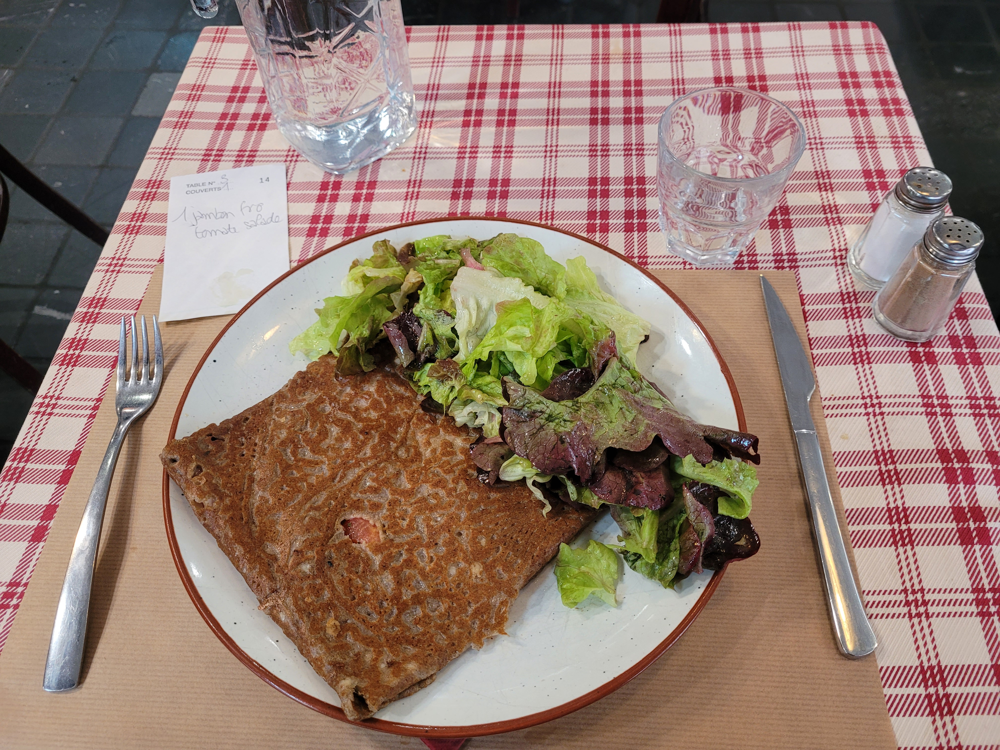
<figcaption>A galette</figcaption>
</figure>

### Boulangeries

Europeans prefer the small, mom-and-pop food shop over the big-box store when possible. In France, the division of culinary labor is much more fine, and is dispersed throughout the community --- you have charcuteries for meat, tabacs for newspapers and cigarettes, fromageries for cheese... and above all, the indispensable patisseries and boulangeries for bread and pastries. A person wandering through any French town or city can, if they find themselves beaten down by the afternoon sun or just in need of a snack, pop in to a boulangerie no more than two blocks away and walk out munching on a sandwich, a flan, a baguette, an éclair, a macaron, or one of any number of that store’s exclusive specialties.
Each boulangerie is different. Some are better all around than others; some make one traditional treat particularly deliciously but are mediocre in the others; a few are just plain bad. The locals learn to differentiate between these and each have their preferred boulangerie.

<figure>
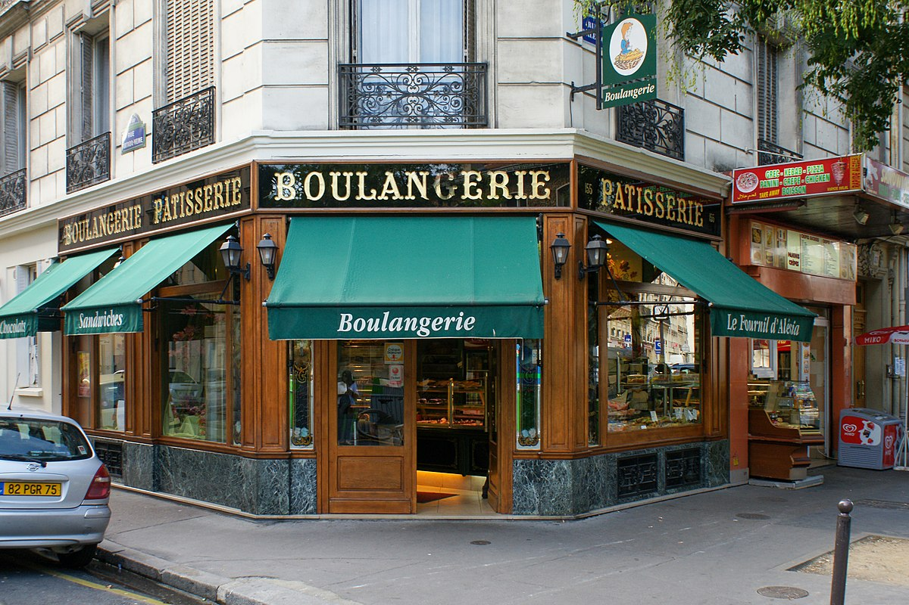
<figcaption>A Paris boulangerie (image from Wikimedia)</figcaption>
</figure>

### Built for People, not Cars

For Americans, it is difficult to appreciate to what extent our country is built for cars until we see a country that isn’t. In Europe, a car is a liability as often as it is an asset. The centreville of every town is a spider’s web of close, winding alleys and branching streets with overhanging arches and flags. Cars find passage through the constant throng of pedestrians difficult if not illegal. For pedestrians like me, this is very convenient. Rennes has a functional and relatively new metro system. I took this to class every day. The central Sainte-Anne metro station was just three minutes away from school, and less than that to all the food, books, supplies, entertainment, churches, and anything else I could need. Cars are basically banished from the old town and have to crawl along the edges of the city and in the banlieus. For this reason the cars in Europe are always smaller than those in the US. Some are even clownishly small.

The metros in France are reliable, well-built, and largely safe and clean. It’s important to stay alert around the entrances to metro stations, because pickpockets are everywhere and some panhandlers are persistent almost to the point of harassment.

<figure>
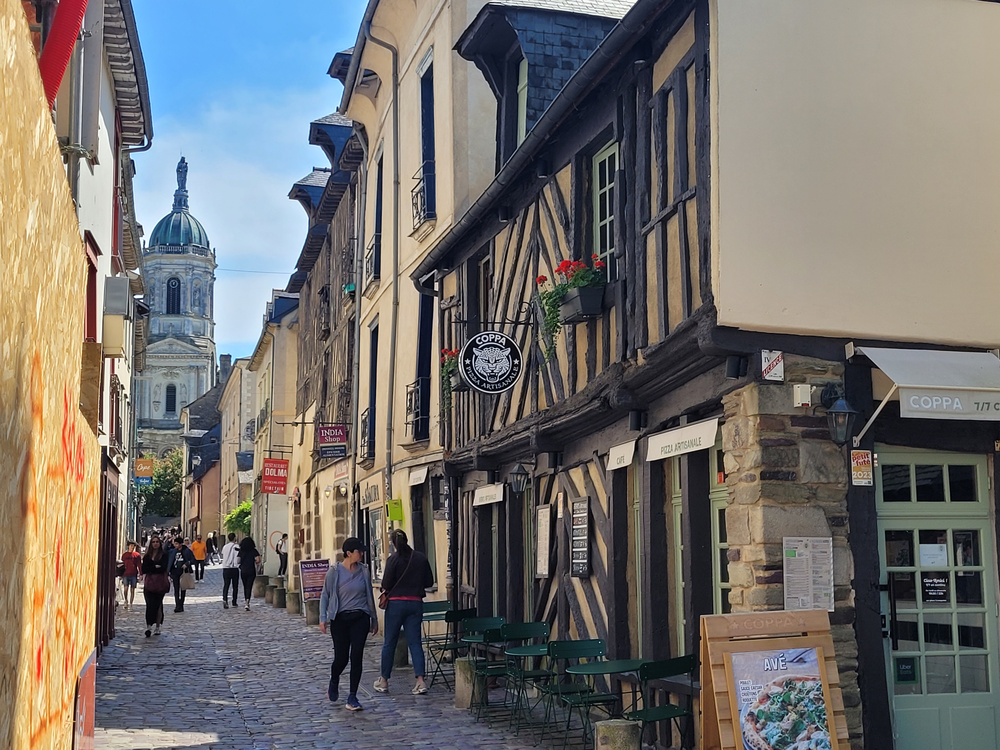
<figcaption>The street the school is on. It's very hard to go on streets like this in a car.</figcaption>
</figure>

### Fashion

The first obvious difference between the French and Americans is that, in general, the French dress more formally. Although this is changing for the young, the French enjoy wearing formal pants, a button-up shirt with sleeves (even when it’s hot out), and a scarf. Both men and women wear scarfs that vary widely in colors and designs; they are the most distinctive marker of French fashion. For an American, dressing in the French style seems unnecessarily formal at first, but it’s also fun.

There’s a stereotype that French people are less clean than Americans. I didn’t notice this in France. If it was ever true, it isn’t anymore.

<figure>
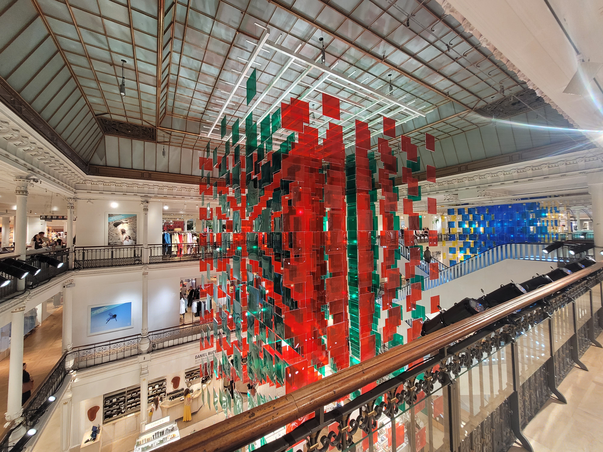
<figcaption>This is the world's oldest department store, in Paris.</figcaption>
</figure>

### La Culture Littéraire

[Reading is on the decline in America](https://news.gallup.com/poll/388541/americans-reading-fewer-books-past.aspx), and it’s been a long time since books were the main form of cultural expression here. Not so in France; literary culture is alive and well here among all ages. Librairies (bookstores) are as densely-packed as boulangeries, and you are never more than two blocks away from one. There you’ll find not just the year’s commercial paperback novels but also essay collections by cultural commentators from every decade, books on every field of science and humanities, and a well-furnished collection of the classics, maybe as part of their selection of Bibliothèque de la Pléiade editions. Pop science and humanities is a major genre here and there are multiple editions that cater just to it with hundreds of books, with Que Sais-je? and Découvertes Gallimard being only the most famous. Most bookstores also have a sizable English section --- I’ll get to the effects of English hegemony later.
Most Americans aren’t aware of just how popular BDs --- bandes dessinées, or comic books --- are in the francophone world. The French are not just obsessed with BDs, they are an indispensable pillar of French literary culture. While in the English-speaking world, we had to rehabilitate comic books by calling them “graphic novels” to get critics to take them half-seriously, in the francophone world bandes dessinées have always been and always will be important cultural and literary touchstones. From Tintin, Les Schtroumpfs, Lucky Luke, and Asterix to modern BDs exploring the francophone immigrant experience like Persopolis, BDs exist covering every imaginable subject. Fully half of Gibert Joseph, the largest bookstore in Paris, is dedicated to BDs. This is all very nice for a language learner like me, because BDs don’t have too much text and teach a lot of argot and more informal words that you wouldn’t necessarily learn in school. The characters in BDs often talk more like people you’d meet on the street--- at least in the 80s.

All this means that manga and anime is even more popular in France than in the US. They got *Sailor Moon* way before we did, and most French people have read at least a little manga. France is the country that consumes the most manga outside of Japan. It also produces a little bit of anime --- “franime” --- like Wakfu. Like in Japan, these are read and enjoyed by people of all ages and genders. 

The persisting popularity of BDs probably contributes to how France has retained a strong literary culture. BDs are more brief to read, not as dense, and they’re a visual medium. All of tis makes them relatively well-suited to the monde médiatique today.

My favorite part of French literary culture is the open-air book markets. In Rennes, there is an open book market in the middle of the Place de Sainte Anne whenever the weather is good enough, which is most days. People set out tents covering many meters of tables. The varnish on the tables is invisible because it’s completely covered with a layer of books and boxes of books. These books are often vintage or antiques and are always very affordable; rarely more than 20 euros and usually about 5. I have no idea who directs these book vendors; whether it’s just a volunteer organization or something more than that, but they’re very cool! It would be wonderful to see these in the USA.

<figure>
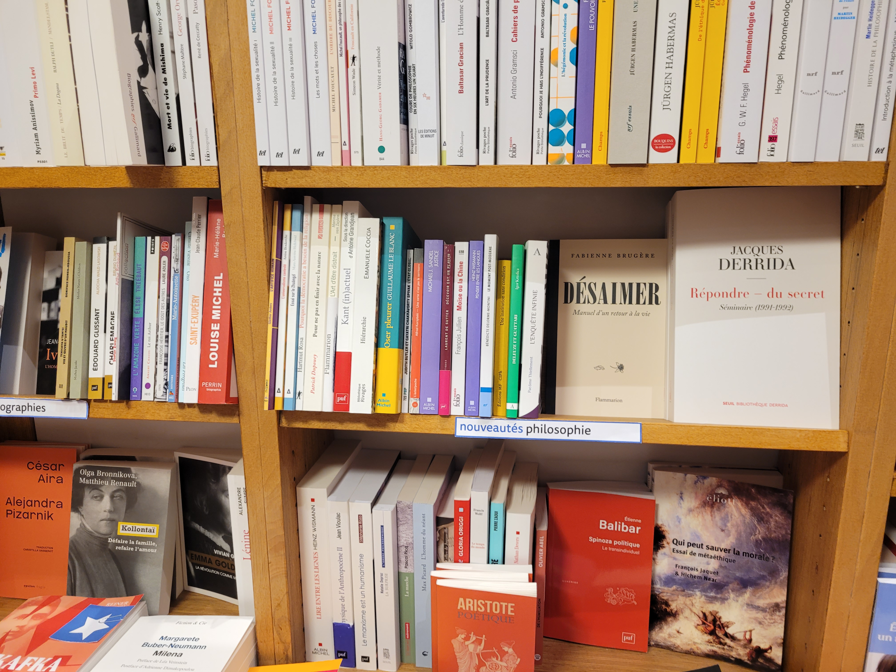
<figcaption>The philosophy section in a librarie</figcaption>
</figure>

<figure>

<figcaption>The Rennes outdoor book market</figcaption>
</figure>

### The Arts

I don’t think I need to tell you that the arts are important in France. France has been a major world art center since the age of Gothic architecture, which initially developed in France. The French government makes an explicit policy out of promoting the arts, which includes setting aside large amounts of money for festivals, plays, and operas every year. This strong desire to promote the arts also appears at the local and the municipal level. As a result, there are more cultural events and they’re usually free or much more affordable than counterparts in the US.

While I was in Rennes there was *Les Tombées de la Nuit* festival, which had a collection of art exhibits and shows, most free or very cheap, especially for students.

<figure>
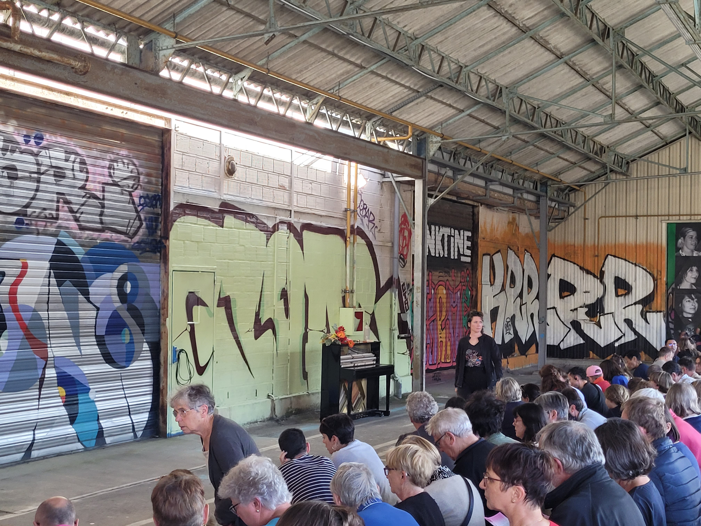
<figcaption>An outdoor production of <em>Carmen</em> during <em>Les Tombées de la Nuit</em>.</figcaption>
</figure>

<figure>
 
<figcaption>An example of art plastique on display during the festival.</figcaption>
</figure>

### La Politique Sociale

The large government investment France puts into its arts and culture, as well as its movie industry, exemplifies one of the most striking differences in European government in general: la politique sociale. It is widely believed in continental Europe that the government is responsible for ensuring the welfare of the individual citizens, including supplying them with job opportunities, entertainment opportunities, housing, insurance, and many other things. This is to say that continental Europe overall has stayed closer to [the post-war consensus](https://en.wikipedia.org/wiki/Post-war_consensus) than America.

There are a lot of benefits even for the foreigner. FranceTV is a Netflix-like government service which provides many French TV shows for free online. It’s really nice and a great way to practice listening.

My favorite is the youth centers that help young folks find jobs, understand the transportation system, and have a space to hang out. These support the coherence of the community.

The healthcare system in France is of course more functional than the American system, even for foreigners. To get prescriptions, I needed to have my American prescriptions converted to European ones, which are valid everywhere in the EU. I schedule a first-time doctor’s appointment, which was available a week in advance, and paid $20 in cash to the doctor after the appointment. I had no primary insurance abroad, and the visit cost me less than many doctor’s visits would cost in America *with* insurance.

### Being Écolo

The environmentalist movement has permeated European culture to an extent unknown in the US. In every park and street corner there are three trash cans --- landfill (not trash), recycle, and compost. Most families keep their own compost heap, and *everyone* recycles. Water and electricity are used sparingly --- it certainly helps that they cost more than in the US. The French call this being écologique, or écolo. Being écolo is a major selling point for cars and houses, which are always listed with an “ecological rating” given by a government body. A similar rating is given for food products to tell the consumer how healthy or unhealthy they are.

Of all the cultural differences, this is the one I hope the most that America learns from Europe. 

## The Neutral

### The Elections

I was in Rennes during the 2024 European Parliamentary Elections. This was a tense and uncertain time. In France, the far-right Rassemblement Nationale (RN) reached a new peak of popular support with their anti-immigration platform, especially in the southern and rural parts of France. By and large, the people were fed up with Emmanuel Macron and his centrist party Ensemble, which had been the dominating force in French politics since 2017. The RN did exceptionally well during the EU elections, which spooked Macron. Macron responded by dissolving the parliament for the first time in 27 years, triggering an immediate snap election for the French parliament.

Macron condemned the rise of the RN and said that he dissolved parliament to give “clarity” to the results of the EU election. For Macron, this was a chance for the French people to do better. Macron also likely felt that he would do better by having the vote immediately instead of waiting for the RN to gather power. This was a risky political gamble, and widely criticized in both the French and American media.

The people of Rennes almost unanimously opposed the RN. From the 10th to the 30th of June, they lit Rennes on fire with protests, campaigns, and riots in support of the Nouveau Front Populaire (NFP), a new coalition of left-wing parties who fought the RN while also offering an alternative to Macronisme.

As Americans, we can’t imagine a new political party being created just in response to one election.

I was lucky enough to attend the vote counting for the constituency I was in. Everyone in France, wherever they lived, could walk to a voting center. After the votes are cast anonymously in boxes, teams of citizens line up around chairs to count and re-count each of the ballots. These ballot counts are free and open to watch for everyone.

[The election turned out to not be a victory for the far right or for Macron](https://en.wikipedia.org/wiki/2024_French_legislative_election#Results). Less than a month after its founding, the NFP became the lead party in the French parliament. Macron’s party was dealt a very heavy blow and came in a distant second. While the RN gained many seats and carries more power now than ever before, it was not the landslide victory many were expecting.

### The French Language

I obsessed over French night and day in Rennes. Its history, literature, grammar, etymology, phonetics, and development are incredibly rich. For the Anglophone, studying French is a lot like peering into an alternate linguistic reality. This reality has fuzzily familiar furnishing and geography, but everything is smoky and distorted, only half-recognizable.
French and English are not sister languages. They’re more like cousins who grew up fighting with sticks in the backyard and picked up each other’s slang in the process.

I won’t dwell on French here, since this is a post on France, not French.  For now, I’ll just note a phenomenon that is often overlooked in the literature but is very important on the ground.

#### African French

[About half of all French speakers are Africans](https://www.rtbf.be/article/en-2023-327-millions-de-personnes-parlent-francais-dans-le-monde-dont-pres-de-la-moitie-en-afrique-11169856). Most of the growth of French since World War II comes from population growth in Francophone Africa. Plenty of people who grew up speaking African French have made the French cities their home: as a result, African French is well-represented among the collection of tongues heard in French cities.

It’s easy to tell African French apart from metropolitan French: the pronunciation is very different, and it’s imported plenty of words from native African languages.

I noticed the pronunciation differences the most. Speakers of African French still pronounce R as an alveolar trill or a flap, instead of replacing it with the guttural R of standard French. Sometimes, they omit R entirely, especially when it appears at the end of the word, like non-rhotic English dialects. Francophone Africans often denasalize vowels and simplify them. One ticket-taker surprised me by saying “dew joe,” it took a second repetition before I realized that was how he pronounced “deux jours.”

Colonial languages play an important role in how Africa conducts business. Relative to the prestige language, much of Africa is divided into one of two patchwork territories: Francophone and Anglophone. The split can cause unrest and violence, and some members of the African Francophonie want to buck French for English, which is seen as more useful. In Cameroon, the English-speaking minority has formed a seperatist group and fights an [ongoing war for independence](https://en.wikipedia.org/wiki/Anglophone_Crisis). Algeria, which has the third most French speakers of any country in the world, [is now trying to transition from French to English](https://apnews.com/article/algeria-education-english-french-4e02e8bcbb2f94d5646e2996db003145#). The future of African French is uncertain.

## The Bad:

### Pop Culture

France’s cultural greatness comes with a severe contradiction. Passing the restaurants, it’s not French music you hear blasting from restaurant speakers, but American rap and pop music. Despite heavy government funding for French cinema, [American cinema draws more crowds.](https://www.statista.com/statistics/386453/distribution-of-cinema-attendance-in-france-by-film-origin/) Video games are all foreign, almost all in English. Popular books are often in English. There are so many American/British brands with English names in France that many French companies have adopted names in English to conform, even local energy municipal companies like TotalEnergies SE, previously Compagnie française des pétroles. French musicians are just as likely to sing in English as in French.

While French high culture is one of the best in the world, there is almost no native pop culture. France, along with the rest of Europe, imports almost all pop culture from the USA and Japan. The American dog wags the European tail in more ways than this, though. The French keep tabs on American politics, and newspapers talking about the upcoming American election are widely sold. The French know about, and sometimes obsess over, American actors, photographers, writers, politicians, and public figures. How many contemporary French public figures can you name?

This shift happened at the end of World War II as the USA emerged to rebuild France on new foundations with its Marshall Plane. The French  in their gratitude developed a sort of cultural obsession with the USA. New communications technologies, led by America, have exacerbated this process.

American influence has not just swept through Europe and the Anglophone countries. Asia, the Americas, and Africa are all affected. This isn’t all bad: it could make countries more open to entrepreneurship, more dedicated to citizen’s equality, and more interested in freedom. An international language expands communication for everyone and makes international cooperation easier. However, we Americans also export our cultural diseases like fast food, excessive advertisements, and obsessing over consumption.

I find this increasing unipolarity of world culture sad. It has made us more united, but it’s been a severe blow to many cultures with thousand-year histories. If the world was an office, America would be the competent but bossy coworker who has a chilling effect on anyone who doesn’t conform with their will. This office dynamic would be toxic and would lead to a situation where office creativity is threatened. The same goes for American cultural hegemony in the world.

For Americas, American cultural homogenization might be practically convenient, but it is spiritually numbing. It gives us undue pride in our culture, and makes travel and understanding other cultures too “easy” --- they have already run 80% of the way, and we just have to cover the remaining 20%. We won’t get as much exercise this way. 

### Smoking

Smoking is far more common in Europe than in the United States. It is very interesting to see this, especially considering the fact that the US doesn’t combat smoking quite as strictly as Europe.  For example, European countries have passed plain labels laws against cigarette manufacturers, meaning the vast majority of the packaging must be taken up with a warning about the harmful health impacts of cigarettes, accompanied by a gruesome image. This leads to the darkly comic image, very common in conversation, of reaching inside a pack depicting rotting to teeth, pulling out a cigarette, and lighting up. Despite this, smoking is still incredibly common in France. We passed many teenagers on the Rue de Soif pretending to be older, drinking their booze and puffing on their e-cigs. Minimum age laws for drinking and smoking aren’t really enforced. Smoking as a part of café culture is as dead as opium. Only the health issues and waste of cigarettes remain.

### Dirt

A lot has changed since Mark Twain went to France in 1867:
> There is no dirt, no decay, no rubbish anywhere--nothing that even hints at untidiness--nothing that ever suggests neglect. All is orderly and beautiful--everything is charming to the eye.
> 
> <cite>The Innocents Abroad— Chapter 12 </cite>

You can still see the glimmer of a society like that, or that aspired to be like that, but only under a thick new layer of urban decay. Cigarette butts, fast food packets, and dog poop litter the streets. Windows broken by casseurs, raging about some thing or another, are a common sight. Graffiti is ubiquitous. What happened?

Population density played a key role here, [as higher population density means more trash](https://typeset.io/papers/factors-determining-waste-generation-in-spanish-towns-and-55iehn8a06). [France’s population density nearly doubled from 1867 to today](https://ourworldindata.org/grapher/population-density?tab=chart&time=1730..latest&country=~FRA), and [is now over three times that of the USA](https://ourworldindata.org/grapher/population-density?tab=chart&time=1600..latest&country=~USA). Culture also plays a role. For some reason, the French don’t seem to care as much about preserving the beauty of their country as you might expect. Signs everywhere beg them not to litter, and cleaning up after your dog isn’t a strong cultural expectation. Added to this is the crisis of confidence in French culture after WWII, as well as increasing social unrest as countries struggle to integrate immigrants.

### Graffiti

Europe has *so much graffiti*. Population density plays a role here, as does the fact that I lived in a largish city while I’m used to the suburbs and small towns. That being said, even the rural parts of France had much more graffiti than the rural parts of America, and likewise for the urban districts. The truly surprising thing might not be that Europe has so much graffiti, but that America has so little.

Some street art is very good, but most is not. 80% of the graffiti is just tags covering the walls of people’s homes and businesses, or even street signs and park maps. People spray graffiti on traffic signs and park maps, making them much harder to use.

<figure>
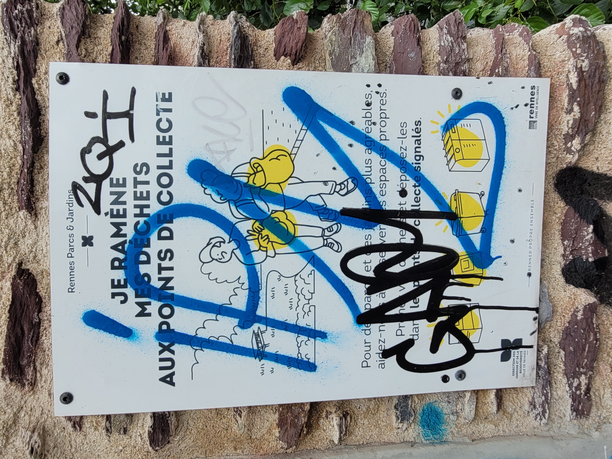
</figure>

It’s not all bad: there’s a good amount of excellent street art and some positive messages (written in English as often as French) scrawled on the walls.

<figure>
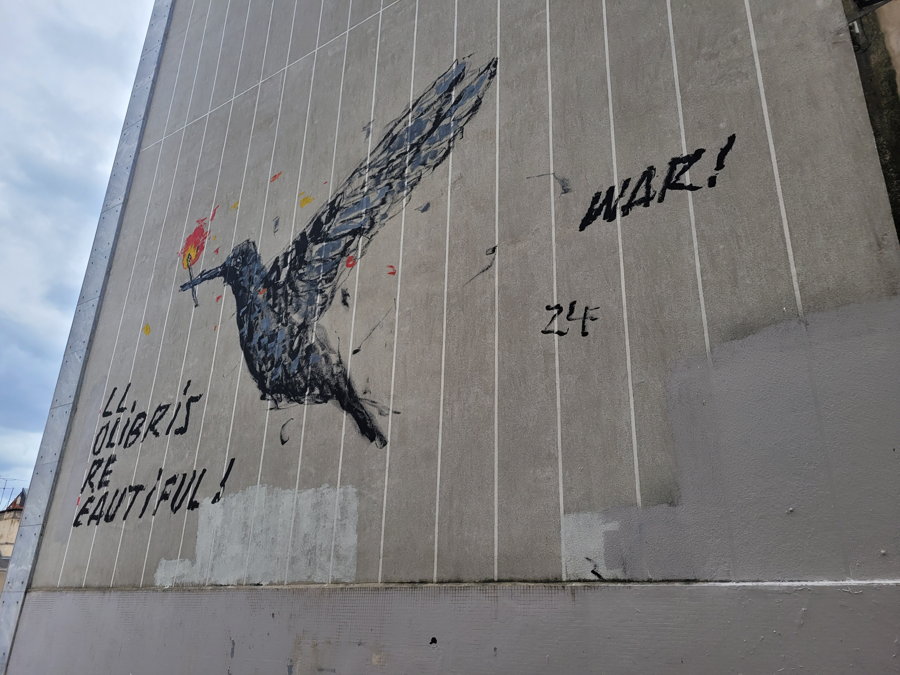
<figcaption>Street art in Rennes</em>.</figcaption>
</figure>

### Crowds

European population density strikes yet again. Nearly every part of Europe is more crowded than the American West. This can get claustrophobic, especially in the malls and shopping centers. Supermarkets are a good example of the downstream effects---  are are like little castles, bristling with defenses against shoplifters and forcing customers along a strict one-way passage. Forget self-checkouts — ~~invaders~~ customers will need to wait in one of three or four eight-person lines in the middle of a loud mass of people. Worse, most of the people are buying a lot of food — enough to last them at least two weeks before they have to go back to the supermarket. I don’t blame them.

# Wandering

After the program ended, I wanted to get to know it outside the Breton cultural region. I wanted to explore the small villages and rural parts of France. In Europe, it’s impossible to withdraw completely from signs of globalization, but I hoped to at least forget them for a while.

I zigged and zagged southeast for three weeks, going through first the Loire alley, then Paris, then taking a train to Marseilles, then finally running down the boot of Italy until Naples. This follows the path of the [old *grand tour*](https://en.wikipedia.org/wiki/Grand_Tour). It was a good route, but at times grueling, especially farther south as the weather got hotter and the crowds more dense.

## Centre-Val de Loire

If France is the jewel of Europe, the Loire Valley is the jewel of France. This is series of towns and farms running along the river Loire. [It hosts one of the greatest and densest collections of castles in Europe](https://en.wikipedia.org/wiki/Ch%C3%A2teaux_of_the_Loire_Valley). They were initially built during the Hundred Year’s War to serve as fortifications against the English, who at the time controlled the territory north of the Loire. The second phase of castle-building came when the valley became the seat of the French king, who demonstrated power by building lavish palaces along the banks in Italian style, even inviting Italian artists like Leonardo da Vinci over to advise them.

The modern Loire Valley still offers beautiful castles, the glorious hills, and the towns that crop up around the castles to serve locals and tourists. I took trains from west to east along the Loire, stopping mainly at the most important castles. I tried to see some of the smaller towns and castles, but these are difficult to access without a car.

### Angers

Angers is the western gateway to the Loire. 

The château d’Angers is structurally austere, being originally a fort. The black-and-white alternating stripes on the tower make it look charred, as if the castle has been plucked out of an inferno. This is fitting because the castle now holds the tapestries of Saint John’s Apocalypse, the largest series of Medieval tapestries still extant. These are astonishing thanks to their size and intricacy. I recommend the visit, but the château gardens are just as well worth visiting. The French have the lovely tradition of rehabilitating their places of warfare, of which there are many, into places of honor and beauty.

It was in Angers that I stayed in the first youth hostel of the trip. The architecture was prison-like, but we enjoyed this, because we each got our own tiny bedrooms with amenities. I talked with some people my age there about what they planned to do with their lives. They were also traveling Europe. The exceptional train station makes travel in Europe very accessible.

<figure>
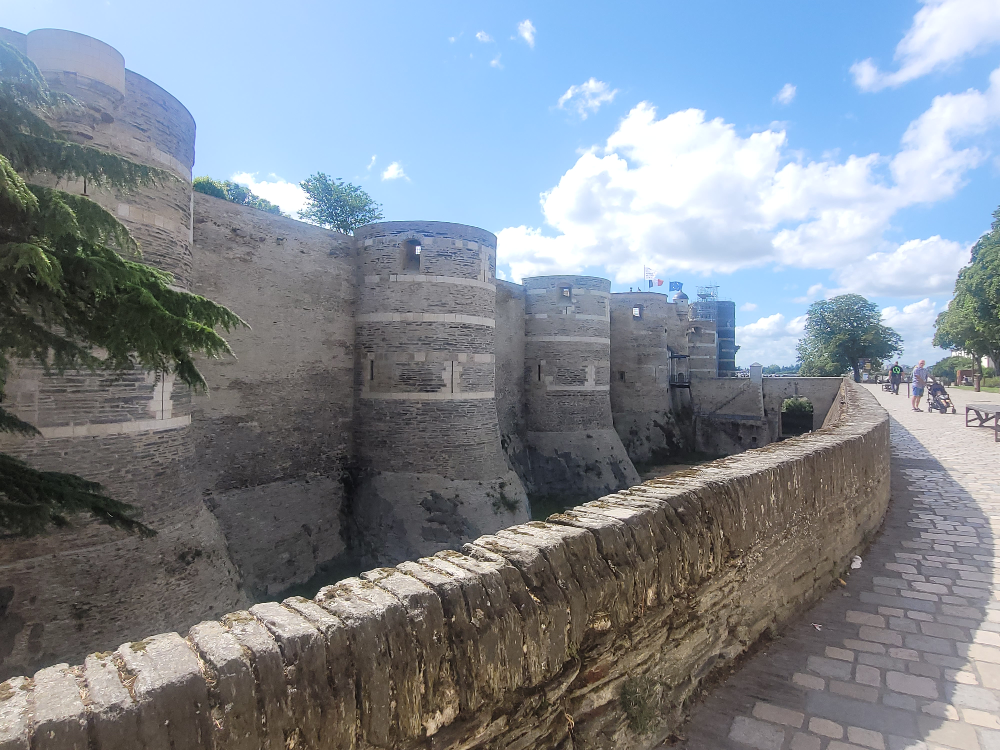
<figcaption>The Château d'Angers</figcaption>
</figure>

<figure>
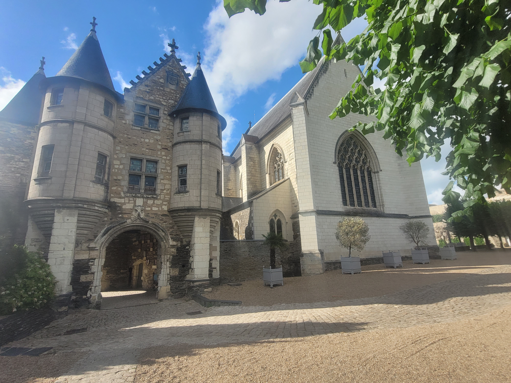
<figcaption>Inside the Château d'Angers</figcaption>
</figure>

### Saumur

Of the small group of Loire valley villages I had the luck to visit, this was the most charming by far. It’s small enough to retain the peaceableness of the French countryside. The castle oversees the Loire, which the town straddles. Cars, bicycles, and people cross two tongues of the Loire, separated themselves by a little island, via bridges dating back to the 19th century.

The castle of Saumur is straight out of a fairytale book. Incredibly well-made and well-preserved, it has been a royal residence, a Napoleonic prison, and a Nazi hideout during its long life. Its sloped blue roofs topped with golden fleurs-de-lis, representative of the Duke of Anjou, that glimmer in the sun of noon, make it especially exceptional.

There are signatures from the past two centuries scrawled across the walls of the Château de Saumur. Many of them are dated and the dates go back well into the 19th century.

<figure>
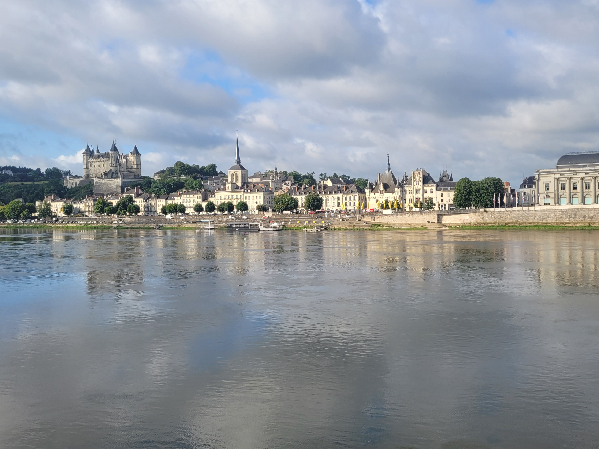
<figcaption>Saumur across the Loire, from the South side.</figcaption>
</figure>

<figure>
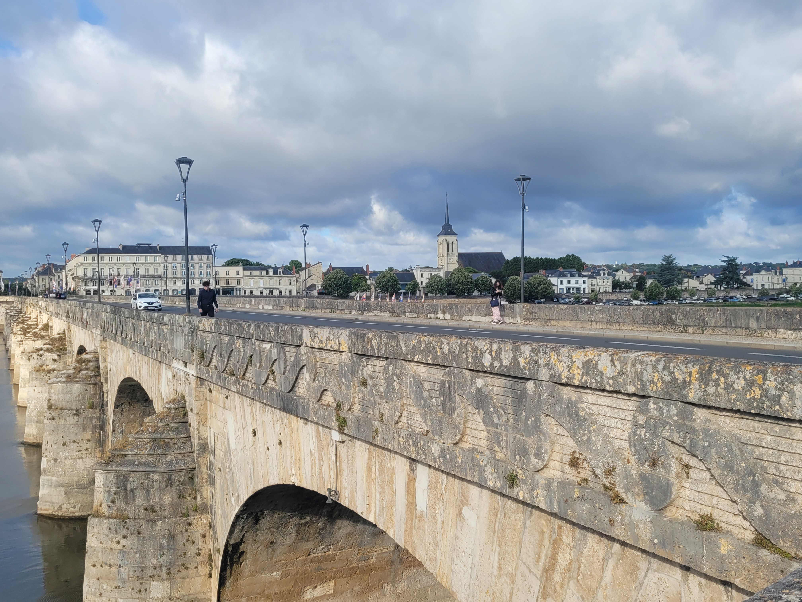
<figcaption>The bridge across the Loire</figcaption>
</figure>

<figure>
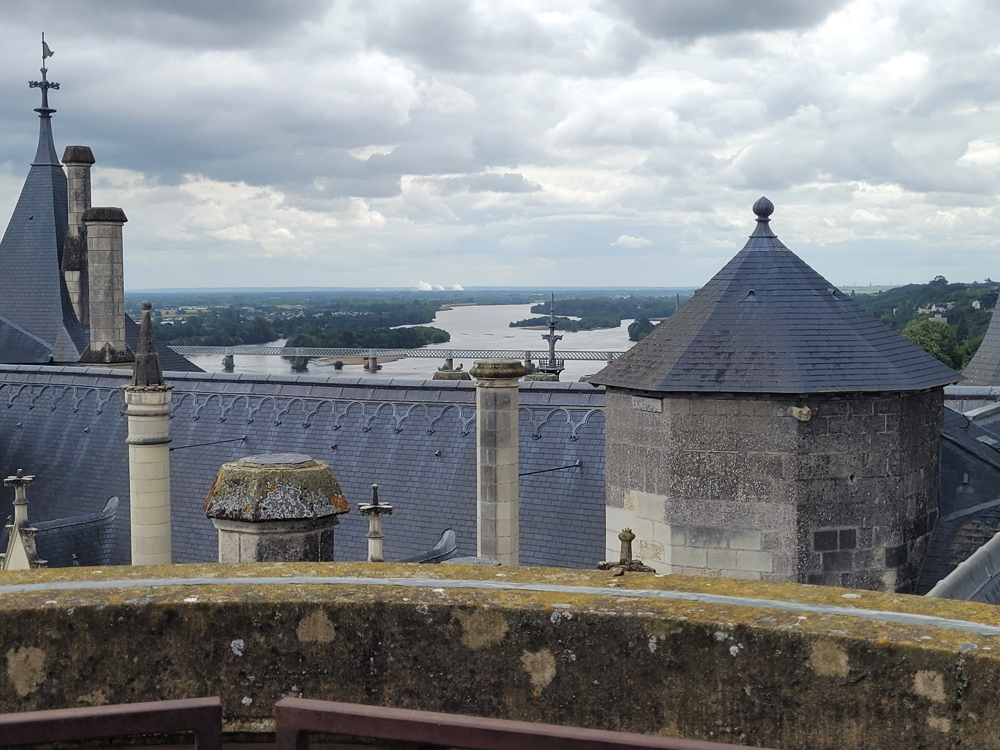
<figcaption>From the tower of the Château de Saumur. The plumes of steam in the far distance are from nuclear cooling towers.</figcaption>
</figure>

I really can’t recommend Saumur enough. It represents the height of the French aesthetic of coziness plus grandeur.

### Tours & Amboise

Tour is the eastern gateway to the Loire. It has the most beautiful train station I saw during the trip.

Tours itself is an impressive city on the Loire, culturally and climatically a lot like a more built-up version of Saumur.

<figure>
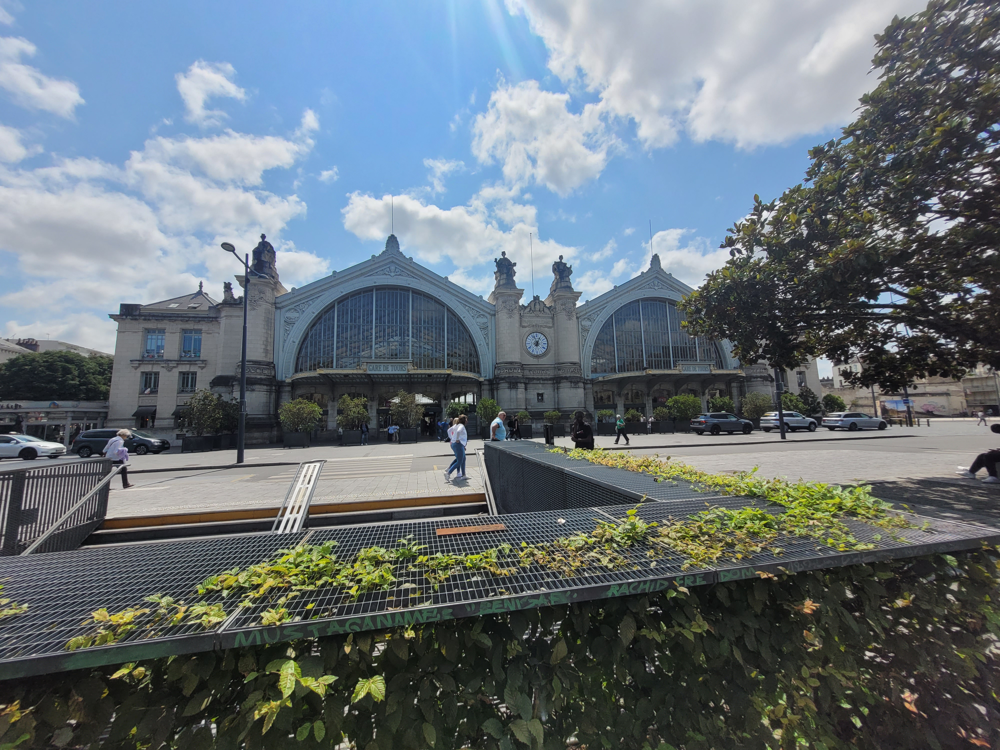
<figcaption>The Tours train station</figcaption>
</figure>

<figure>
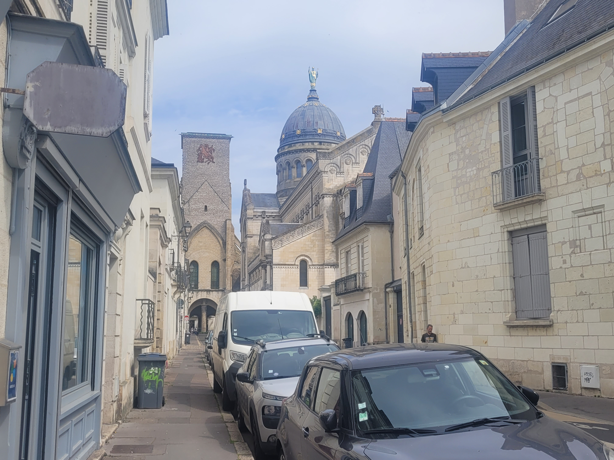
<figcaption>A street in Tours. On the right is the dome of the Church of St. Martin</figcaption>
</figure>

I biked from Tours to Amboise and back, on a rented bike. The bike path I used was part of the EuroVélo network. Bike paths between settlements are not quite as good as you might expect: they don’t always follow the main autoroutes, so it’s often better to take a detour in the little paths between the hamlets and among the fields. These are very scenic.

<figure>
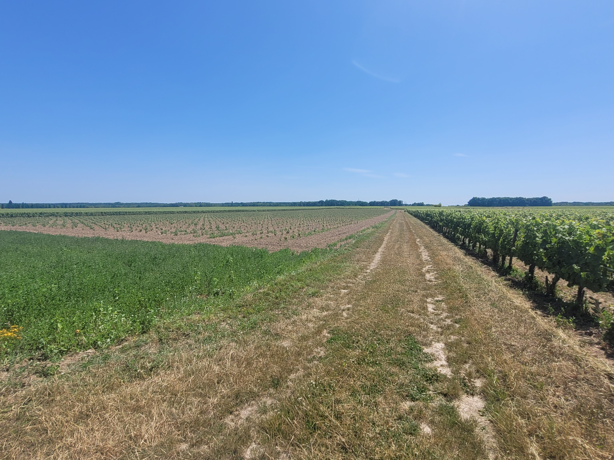
</figure>

<figure>

</figure>

Leonardo da Vinci spent the latter part of his life near the Château d’Amboise and is buried there.

<figure>
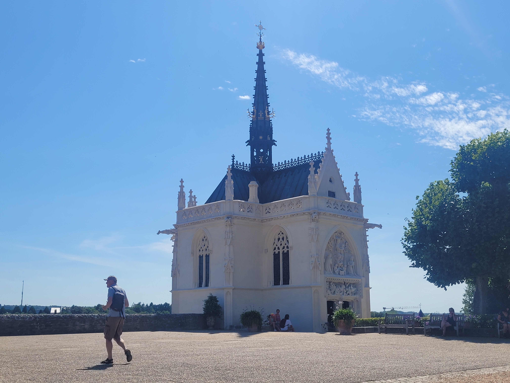
<figcaption>Da Vinci's Tomb</figcaption>
</figure>

<figure>
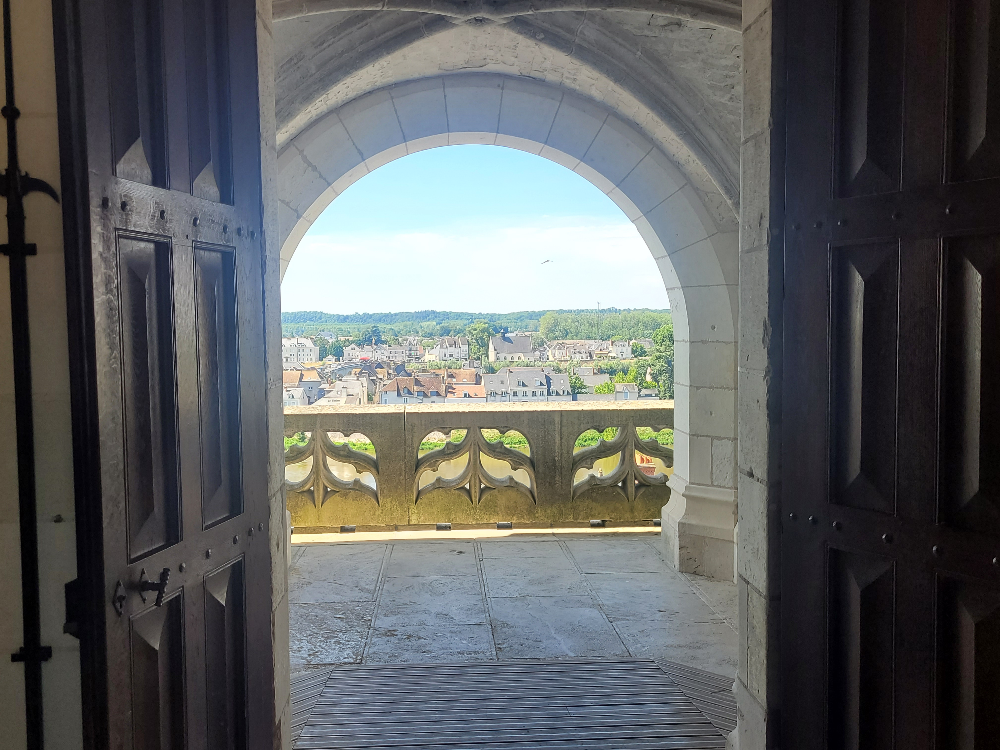
<figcaption>The view of Amboise from the Château</figcaption>
</figure>

## Paris

Paris is unlike any other city in the world. Its architectural was carefully reconstructed in the early 19th century as a dedication to rationalism. Unlike London and New York, there are no skyscrapers in the center of the city, which are instead set aside in La Défense, a neighborhood with a character all its own.
I won’t bore you with the typical recommendations of things to do in Paris. Here are a few relatively lesser-known sites that I recommend:

* Les Invalides ← Napoleon’s lavish tomb is here, and there’s a good museum of French military history.
* Le Musée de Cluny ←- The museum of the Middle Ages in Paris. It houses the famous Lady and the Unicorn tapestry, which is well worth the visit.
 *Muséum National d’Histoire Naturelle ← It’s in Le Jardin des Plantes. The largest collection of taxidermy I’ve ever seen, largely collected during the colonial. All signs and descriptions are in French.
* La Grand Mosquée de Paris ← The first Mosque in Paris, built after the First World War to commemorate Muslim combatants for France. It’s a fantastic example of Islamic Architecture and open to tourists.
* La Défense ← The modernist district of Paris, it has many skyscrapers.
* La Bibliothèque Nationale de France ← Along with La Défense, it is another of the Grands Travaux of François Mitterand. It’s a monumental modernist library, with four great L-shaped towers that surround a garden.

## Marseilles

Southern France has a completely different climate from Northern France, as it is far hotter and drier there, and more similar to the rocky, sea-lapped shores of Italy. I didn’t spend too much time in Marseilles, but the castle along the rocky shore is certainly picturesque.

<figure>
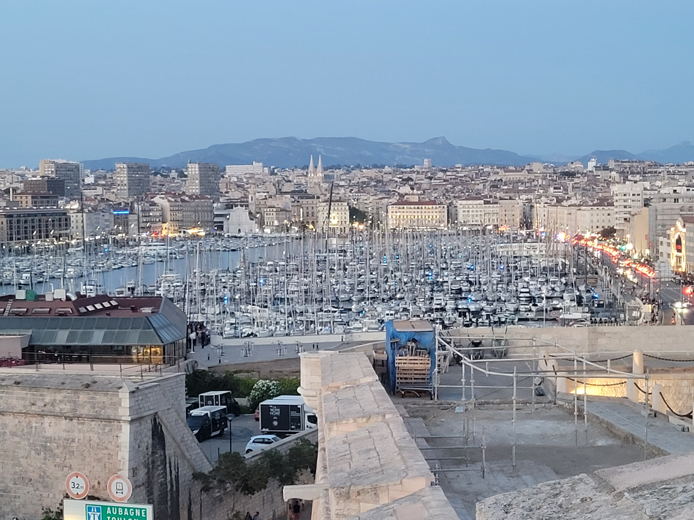
</figure>

## The Culture of the International Youth Hostel

Modern European youth hostels have a very particular marketing style and interior culture that is only loosely connected with the host country. Since I first really experienced this in Italy that I first stayed at a lot of youth hostels, I’ll take a brief aside here to explain it.

I don’t think most Americans really understand just how influential their culture is. Many youth hostels in Europe today reflect a new “International Style”--- primarily but not only influenced by Americulture --- that is designed to appeal to European twenty-somethings.

Imagine an American frat house with more modernist decorations and political slogans. There’s regular football instead of American football playing on TV. Inside are a gaggle of European yuppies all speaking English and ready to party. That’s the impression you get when walking into the lobby. 

English is the first language of service, but the receptionists at the hostels I stayed at in Italy could also speak Italian and Spanish. There’s a strong emphasis on American ways of socializing --- one hostel even had a beer pong night. Another served an all-American breakfast without a touch of Italian influence. In these spaces American culture is removed, transplanted, and mixed freely with the cultures of the other hostel yuppies --- but only in a deracinated way, and in a very postmodern context. The message is: “we might have come from the edges of the globe, but here that’s all just trivia.” 

<figure>

<figcaption>Table in a Milan hostel</figcaption>
</figure>

## Italy

The heat and crowds of Italy were punishing. Don’t come in July and August like I did. If you must come in the summer, it’s recommended to retreat indoors in the early afternoon to avoid the worst heat, then come out again in the late afternoon. The morning is the best time to do most outdoor activities.

Although it’s generally said that the water is safe to drink in major Italian cities, I recommend only drinking bottled water. I did get a serious stomach illness starting in Florence and throughout the stay in Rome. It’s safer to only drink bottled water in Italy.

### Milan

Emerging from the subway in the place of the Duomo, you feel a strange concentration of artistic *majesty* and *grandeur*. There’s this sense that Italian art has always sought to bring the viewer a bit closer to God.
The Duomo of Milan is absolutely recommended; it’s the third largest church in the world and the result of over 500 years of work. The walls are so intricately carved that no space on the walls is left blank. The intricacy is almost like a fractal.

Another cool thing about the Duomo is that you can go on the roof. For a small extra fee and a little bit of stair-climbing, you can stare at the skyline of Milan, which includes in the far distance the skyscrapers of the new quarter.  There’s no less to look at in terms of intricate carvings and artistry on the roof than there is in the interior.

<figure>
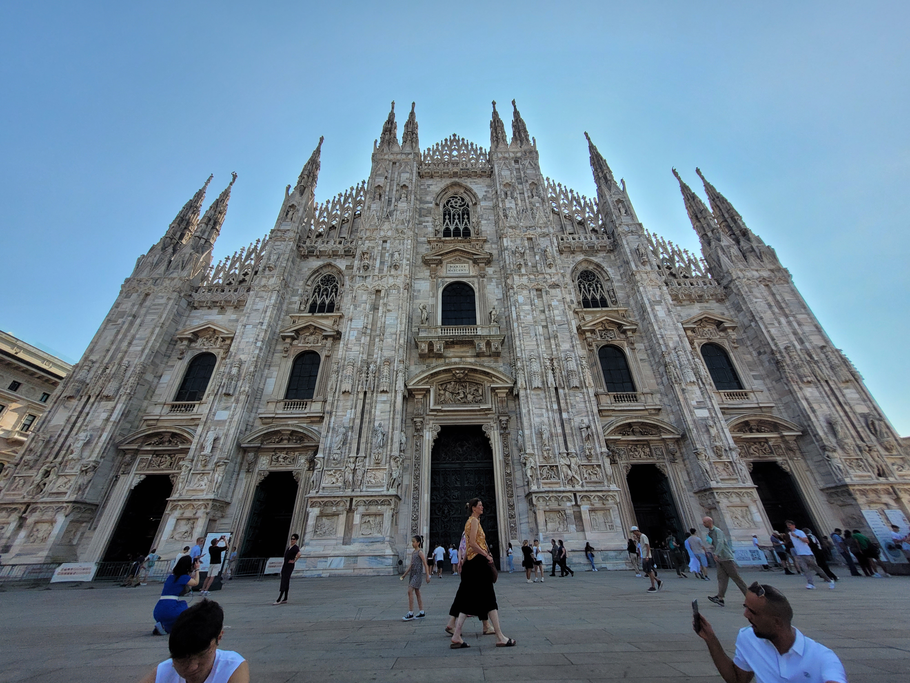
<figcaption>The Duomo</figcaption>
</figure>

<figure>
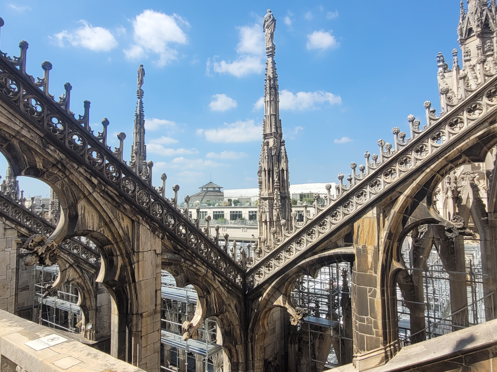
<figcaption>The roof of the Duomo</figcaption>
</figure>

### Florence

Central Florence is just as beautiful. The countryside around the city resembles painting landscapes, mostly because so many paintings reference the Italian countryside. The central church is likewise very beautiful.

I saw the Uffizi museum, which contains many of the works of the Italian Renaissance masters, as well as a massive collection of Roman artwork. It’s worth noting that this museum is hundreds of years old and is a work of art in and of itself. Frescoes representing the arts, the Renaissance popes, and various royals adorn the ceilings of the upper levels of the palace. The quantity of Ancient Roman artwork here is just staggering. It’s a struggle to go through the entire museum. There are a few works by Botticelli and da Vinci here: I liked especially da Vinci’s Annunciation.

### Rome

I do not recommend getting an AirB&B near the Termini Train Station, no matter how convenient and cheap it might seem to be. This was the height of my stomach illness, so I didn’t get to see all that much. Anyway, I was starting to get a little homesick and tired of moving every two days.

I saw the Colosseum and the Roman Forum. They’re both cool.

<figure>
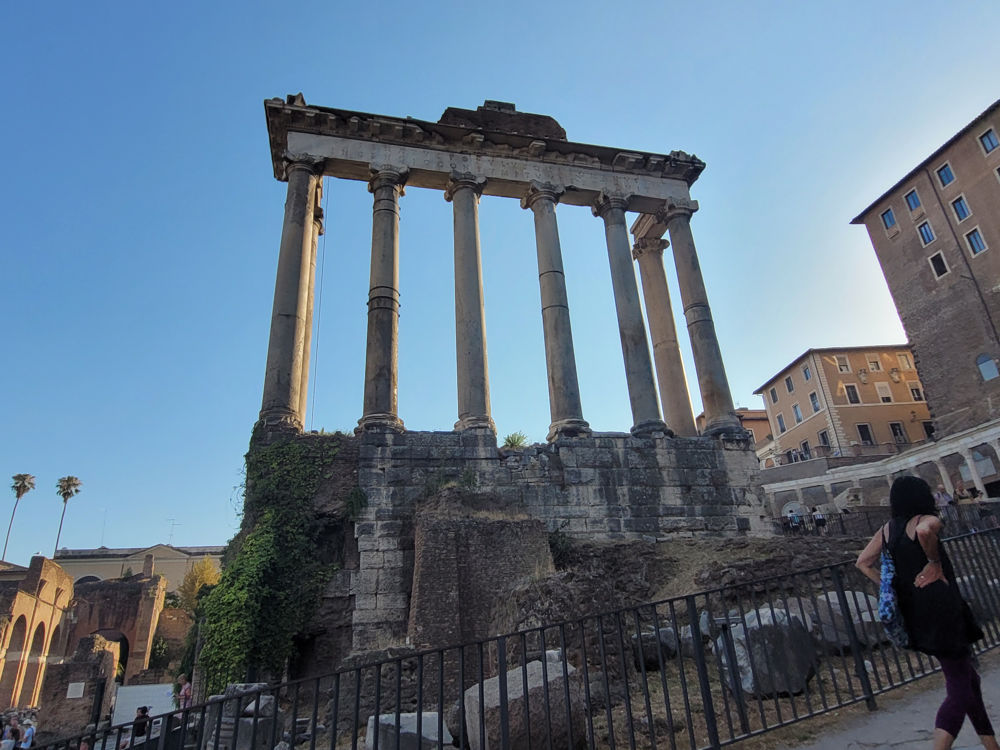
<figcaption>Romans pass ancient ruins every day on their way to get groceries.</figcaption>
</figure>

####  The Vatican Museum

The Vatican museum was awesome, I wish I had had more time to walk through the Vatican and didn’t feel so sick at the time.

The most impressive part of the Vatican Museum for me, was the vast collection of Roman statuary and painting. For hundreds of years, Italians have been finding Roman statues and Greek frescoes in the ground, and for hundreds of years, they would give them to the pope in exchange for a blessing. Thus the antiquities collection was assembled. It is one of the largest in the world.

Nearly all the statues are marble Roman copies of Greek originals. The originals wee largely cast in Bronze, a valuable metal that thieves dug up and melted down during the middle ages, explaining the lack of Greek originals.

Greco-Roman painters were incredibly skilled in color and line. In many cases the art they made two thousand years is better than what we make today. Once you see these, it becomes easy to understand why European, Islamic, and Indian art was influenced for so any centuries by Greco-Roman art. Maybe we still haven’t surpassed their fierce belief in art as a way to influence and uplift society and daily life.

### Naples

Naples was neat.

I went to Pompeii. It’s incredibly well-preserved. Not only is nearly all the architecture intact still mostly exist. The Romans painted almost every interior wall with floral designs --- yet another thing that they exceed us in.

Another striking thing is the size of Pompeii. It’s surprisingly large. Its size surpasses that of the old towns of many modern cities. Unlike those medieval old towns, the streets are straight and narrow. This helped with interior transport and kept everybody cool. Extensive archaeological digs have been led at Pompeii, but much work remains to be done.

<figure>
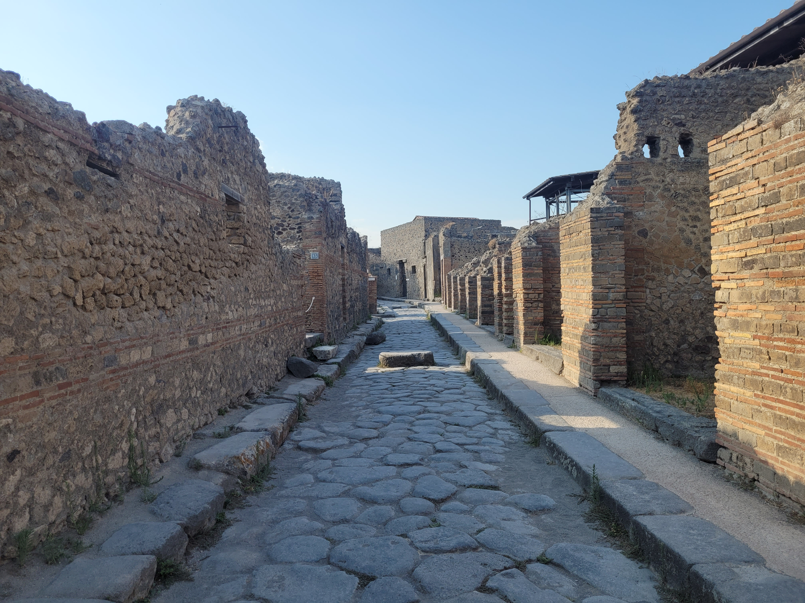
<figcaption>A street in Pompeii</figcaption>
</figure>

### The Louvre

My flight from Europe came from Paris, so I returned there for three more days to visit the Louvre.
It wouldn’t be far-fetched to say the Louvre the greatest museum in the world. It houses a palace-sized collection of ancient, medieval, and modern relics collected by the French royal family, and later by the Republic, across hundreds of years. There is so much here beyond the Mona Lisa and the Raft of the Medusa. Here are a few relatively overlooked wings that I recommend:

* The Richelieu gallery, covering Northern Europe and paintings of France
* The Sully Gallery --- covering mostly Near Eastern Antiquities
* The Medieval Louvre --- Foundations of the Louvre from when it was a defensive fort. Found in the basement of the current louvre
* Gallery of Islamic Art, Room 186

I recommend the audioguide, which are the coolest I’ve ever seen. It’s a Nintendo 3DS equipped with special software that has an interactive map of the palace and pointers to hundreds of artworks. Each of these has its own audio track, and many have multiple.

Remember that **tickets to the Louvre must be booked well in advance — at least two months for good tickets, that is morning tickets**. You can easily spend multiple entire days in the Louvre.
tickets

<figure>

</figure>

# The Ecstatic Return

After the touchdown in Boston, I wandered the old town for eight hours in a state of bliss. Everything is so big! Everything is so new and clean, it’s like Disneyland! American English! I was like a microbe that had been transferred to a cold petri dish with little nutrients, made to adapt, and then returned to its original home with all its abundant warmth and nutrients. I’m not quite sure if this was reverse culture shock, or if I was just tired and very happy to be home.

<figure>
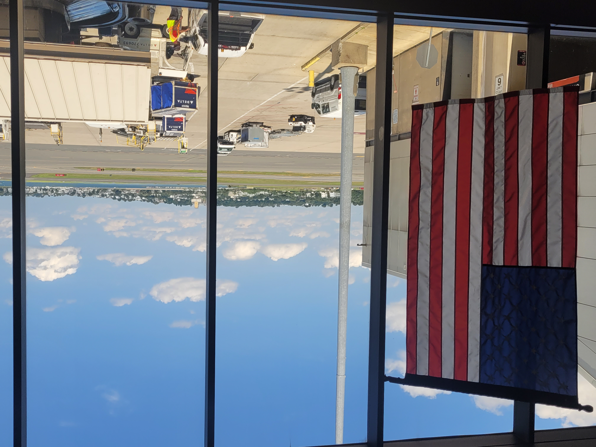
<figcaption>The first view of America I saw in the Boston Airport</figcaption>
</figure>

# Conclusion

Europe is well worth the visit. It’s the most crowded theater of modern history. Even in the countryside, you can’t drive ten miles without running into some place of historical significance. It’s a diverse and heated continent with a chaotic history. But don’t just go for Europe’s past---  pay attention to the present, too. While the EU has calmed matters, there’s still a good amount of heat beneath the surface, and interesting changes still erupt now and then.

It’s expensive for most Americans to travel to Europe, but it’s worth the money. Everyone interested in culture or history should go at least once.

Immersion is perfect for second language acquisition, and it would be impossible for me to understand French *as it is really spoken* without having been in the country. I definitely recommend immersion for anyone interested in really mastering a language. It’s not required for proficiency, but it is for mastery.

If you are going to Southern Europe, try not to go during the summer. Fall and Spring have the best weather and crowds.

This experience connects to long-term travel and digital nomadry. Many people dream of jetting off to their favorite place in the world, living there, and working remotely in an idyllic beach or in a mountain villa. The reality of living abroad is quite different. The long-term traveler must contend with endless uncertainty and instability. They need to be comfortable with not knowing where they’ll sleep in a night. They need to be comfortable with having their plans fall through, their hotels cancel, their trains arrive late, and their resources being unavailable. They’ll likely be hemorrhaging money throughout their journey.  Long-term travel can also be quite lonely, since you will be quickly be miles away from anyone you meet along the road. It’s an exciting lifestyle, but often a grueling one, and only the most hardy souls can sustain it in the long term.

In the introduction, I mentioned that travel has never been more accessible than it is today. We are living in a golden age of tourism. There are signs that this golden age will not last forever. [A flight between New York and Paris adds 100,000 kilograms of CO2 to the air](https://www.carbonindependent.org/22.html). International law may not tolerate this level of pollution forever, and even if it does, fossil fuels will not always be as cheap as they are. International flights are likely to become more expensive or even inaccessible in the future.

Europe itself may close off. European infrastructure already groans beneath the strain of mass tourism in peak season. [Europeans are fighting back.](https://apnews.com/article/anti-tourism-barcelona-summer-travel-airbnb-df764ed1c7009fdbbf5a32eaedc6ffd5) Deglobalization may continue to widen the gaps between the world’s nations.

This is the golden age of tourism. Take advantage before it ends.