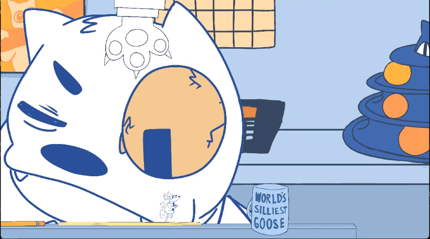
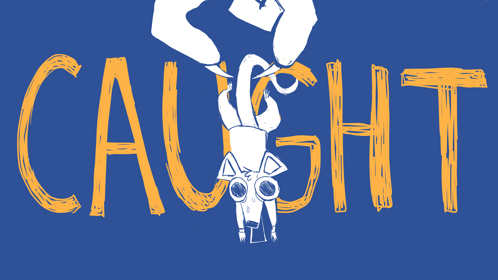

Many friends and I developed *Rat Him Out!* at the GMTK 2024 Game Jam!

[Play it Here!](https://collisteru.itch.io/rat-him-out)

This was my first game jam. I should rather say *our* first game jam, because the four friends I invited to join in invited two more friends, and it was everyone’s first Game Jam. By the time we were all gathered, the team looked like this:

* 5 programmers — including me. One of them joined in on the last day.

* 1 artist

* 1 musician and sound designer

Right away I noticed two problems with this team composition. The first is that it’s heavily lopsided towards programmers, which reflects my social circle. The second irregularity is that there’s no game designer. We ended up designing democratically; everybody spitballed ideas, we chose the ones that sounded best and then took far longer to implement them. This wasn’t terribly effective from a design perspective, and design and gameplay are probably the weakest parts of the finished game.

# Conception and Story:

As the countdown to the GMTK 2024 game jam commenced, we projected the livestream on a television for us to watch as we saw the reveal of this year’s theme: *Built to Scale.* This lovely theme forced us to scrap all our previous ideas and quickly think of what we could do to feasibly incorporate it. The concepts of size difference and size changes most naturally arise when someone things about the phrase *Built to Scale*, and so our brainstorming revolved around these notions. We were interested in the concept of being a small animal navigating a big world— a rat. While we initially thought of a rat navigating a maze, we decided this wouldn’t get us high ratings for creativity. Our artist suggested the concept of an anthropomorphic rat working in  an office building where everything is bigger than him, who has to avoid an annoying cat antagonist. This is how the premise of *Rat Him Out!* came to be. You play as Ricky the Rat, an IT guy at a corporation much larger than himself, who tries to rat out that his employee, Felix Bigsby, is a regular catnip user who shouldn’t have passed his drug test. For a game jam platformer, we spent a lot of time on the plot, and I wonder whether it was really well-spent. Players obviously thought that the dialogue boxes were more of a nuisance than entertainment, and the plot isn’t incredibly compelling. On the other hand, our art required us to tell a little bit of story, and we could only do so much in 96 hours.

# Design:

Inspired by the new art and story direction, we decided that a sidescrolling perspective would be easier on the artist than a top-down view. The pitch for the gameplay becomes “a stealth platformer where everything is bigger than you.” I think this idea has a lot of potential: one can imagine a game where you can’t defeat the antagonist directly so you have to rely on tricky uses of the environment to impede their progress — spilling something on them, distracting them by making something else collapse far away, etc. Hundreds of directions were open to us, but we could only take one or two paths in the 96 hours we had. We ended up with a game where you can jump and crouch in addition to running bank and forth, and where you have to hide behind cover objects to avoid Felix’s giant arm as it comes down to try to crush you. With the time we had, we developed a game where the optimal strategy is to hide behind an object until Felix falls asleep, then run and platform to the next object to hide behind while dodging a hand that’s easy to dodge. It’s not a bad start, but let’s just say it’s a good thing that our game can be beaten in five minutes. 

<figure>

<figcaption>There's Ricky near the bottom. The hand on top follows Ricky and slams down to try to capture him after a constant amount of time elapses. If Ricky falls into a pit or touches the hand when it's coming down, he's sent back to the beginning of the game. This isn't too frustrating because the game is so short. One issue many players cited is difficulting telling foreground from the background. The mug here is in the foreground, but it's not too obvious.</figcaption>
</figure>

# Aesthetics:

While the gameplay design of the game is a little underdeveloped and uncreative, the game’s music and especially its art were praised by almost everyone who played it. Game Jams tend to be programmer-heavy, so a lot of the games used stock art and music. We were really lucky to have dedicated people working on the aesthetic half of the game and it seriously made the final product stand out agains the thousands of games that were submitted. The limited orange-blue color palette of the art was particularly effective. I don’t have too much else to say about the art and music since I didn’t work on them, other than that they were great and I’m very grateful to Jules and Tyler!

<figure>

<figcaption>Jules' art style gave the game a distinct  personality.</figcaption>
</figure>

 
 

<figure>
<audio controls>
  <source src="/audio/rat_him_out_main_menu.mp3" type="audio/mpeg">
Your browser does not support the audio element. D: Consider switching to a newer browser.
</audio>
<figcaption>This is the main menu theme, my favorite theme from the game. The office sound effects are fantastic! The tracks each communicate a different mood in the same style.</figcaption>
</figure>

# Programming:

The programming, however, was a mess that I am at full liberty to exposit on. 

For our game engine we chose Godot. I’ve known for a long time that if I ever did a Game Jam, I would make the game in Godot. Its star is clearly ascendent after [Unity’s decision to charge developers per install for all games made with Unity after the fact](https://www.nytimes.com/2023/10/09/technology/unity-chief-resigns-after-pricing-backlash.html). While the community backlash forced them to roll back this decision, the damage to their reputation is done. Since Godot is open source, I’m confident we were investing in a game engine that won’t ever pull the financial rug from underneath us, or even charge us at all. Godot is the best option for new developers.

Choosing Godot was easy; the harder part was learning it. I put in a little effort to learn the basics before the hackathon, but for the most part we all learned by doing during the hackathon. We were pretty effective with this, but we also encountered many speed bumps we wouldn’t have if we had prior experience with the engine. I expect the development cycle for the next game to be far faster.

Getting five programmers to coordinate wasn’t easy: we would pass around each problem among each other until someone agreed to work on it, and this person then periodically updated us on progress. The biggest problems came with merge conflicts, and this illustrates one of the the most problematic aspects of Godot: it doesn’t work well at all with Git. We had a number of problems with Git and Godot. The first is that whenever we ran our game to test it, the famous Godot dialogue extension we used for dialogue changed the internal list of dialogue files for internationalization. This meant that we had an extra change to deal with in git *every single time we ran the game.* However, while this annoyance was omnipresent, it was only minor — merge conflicts were a far more severe problem. Whenever you update a scene in Godot, Godot at least two parts of the .tscn file— the lines in the document describing each node in the scene and its properties, and a poorly-documented first line that describes the scene’s `load_steps` , `format`, and `uid` . This line typically would become merge conflicted during a merge attempt — and when we tried to fix it, half the time the merged .tscn file would be unreadable. Researching `load_steps` led us to believe that it counted the number of objects in the scene plus one, but when we laboriously tried to figure out what that number would be in the merged scene, it usually did not fix the merge (I need to test this further, however).  For the second half of the jam, when we encountered this problem and couldn’t make the merge work, the person who did the least amount of work typically just had to rebranch from main and do it all over again. This slowed us down considerably. Hopefully, in the future, we’ll get better at resolving the quirks in how Godot updates its internal files.

Despite these problems, Godot is a solid enough engine to code in. GDScript is syntactically accessible and powerful, my only main gripe with it being that it’s impossible to declare global variables within a script without preloading it. We didn’t feel the need to “set up” any of the basic functionality we wanted — most game objects exist out-of-the-box as a type of node, and after years of experience the developers of Godot have clearly gotten good at predicting what a game developer will want to do. Other than a few other quirks and annoyances typical of open source software, I was happy with the experience of coding in Godot.

One last word I’ll say on  programming is that we might have had too many coders. Any amount of parallelism we gained by having more coders was offset by the time wasted in re-explaining how to implement features to people who hadn’t done them before and the increased number of merge conflicts. There’s a well-known adage in coding that says that developer team productivity decreases when adding more people than three, and I believe this is true. A more lean coding team of two or three people, coupled with a designer and gameplay specialist who could keep tabs on everyone and make sure that the core concepts of the game work, will be more effective.

For all of these issues, the programming team pulled multiple all-nighters on this game and we shipped a feature-complete game with no severe bugs or issues, which is more than can be said for a lof of game jam games. I’m proud of the work we did programming this game, and it says a lot that some of us plan to stick around to keep improving the game even after the jam.

# Playtesting:

While we playtested extensively internally, we had no external playtesters, and this turned out to be a problem. Many of the raters and reviewers complained that the text boxes blocked parts of the level and the player, which completely blindsided us. We never would have thought this would be such a problem from our own gameplay experiences alone. Next time, we will remember to playtest.

# Conclusion and The Future:

I came into the game jam with a simple goal: to make a complete and functional game. Given how inexperienced we all were, I thought that was already ambitious, but we actually exceeded that goal by a lot. The game is technically complete and has no severe bugs. It has great, custom-made art and music, and a decent story to boot. The gameplay is simplistic but fun, and the stealth mechanics are not too often seen in platformers. I think the game has a lot of potential to build on. If any members of the team choose to keep updating it with more content, I’ll keep this blog updated.

Do I recommend game jams for interested coders? Yes, absolutely, but not just programmers — game development is interdisciplinary and the community needs more writers, artists, musicians, designers, and socialites to fill the skills gaps that exist. I think it’s the fact that game development intersects so many disciplines that makes me interested in it— there’s a sense of solidarity with your team as you work to pool your diverse talents to make a wondeful and unique experience. Game development seems to reach around to all parts of the universe. There’s no better medium for our globalized, multimedia, attention-starved age.