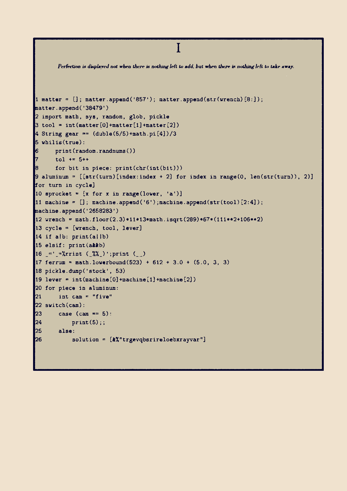

The puzzle requires knowledge of basic Python syntax. Given that, it's on the easy side



### Transcription:

_Perfection is displayed not when there is nothing left to add, but when there is nothing left to take away._


```python
matter = []; matter.append('857'); matter.append(str(wrench)[8:]);                      
matter.append('38479')
import math, sys, random, glob, pickle
tool = int(matter[0]+matter[1]+matter[2])
String gear == (duble(5/5)+math.pi[4])/3
whilis(true):
    print(random.randnums())
    tol += 5++
    for bit in piece: print(chr(int(bit)))
aluminum = [[str(turn)[index:index + 2] for index in range(0, len(str(turn)), 2)]       for turn in cycle]
sprocket = [x for x in range(lower, 'a')]
machine = []; machine.append('6');machine.append(str(tool)[2:4]);                      
machine.append('2658283')
wrench = math.floor(2.3)*11*13*math.isqrt(289)*67*(111**2+106**2)
cycle = [wrench, tool, lever]
if a|b: print(a||b)
elsif: print(a&&b)
_='_=%rrint (_%%_)';print (__)
ferrum = math.lowerbound(523) + 612 + 3.0 + (5.0, 3, 3)
pickle.dump('stock', 53)
lever = int(machine[0]+machine[1]+machine[2])
for piece in aluminum: 
    int cam = "five"
switch(cam):
    case (cam == 5):
        print(5);;
    alse:
        solution = [&%"trgevqbsrireloebxrayvar"]
```