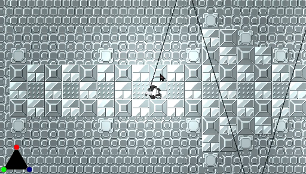
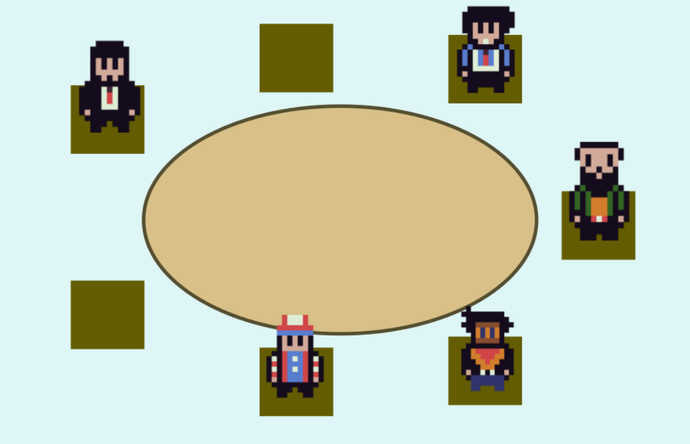

# Software

| Title | Description | Picture |
|----------|--------------------------------------------------------|---|
| [MALWARE](https://collisteru.itch.io/malware) | The second game jam game I programmed for. Strategize before firing as you make your way through all fifteen levels in this puzzle shooter! |  |
|[Complex Negotiation Among AI Language Agents in Werewolf](../../docs/thesis_prop_redacted.pdf)|**Language agents are the closest the field has come so far to general agents. How well do they deceive each other?** The senior thesis for my B.S. in Computer Science. Work in progress. ||
| [Rat Him Out!](https://collisteru.itch.io/rat-him-out) | I led the programming for this submission to the 2024 GMTK Game Jam. We got into the 81st percentile of all submissions! |  |
| [Phonopro](https://phonopro.netlify.app/) | A website to teach the International Phonetic Alphabet. Won first place in the 2024 Blasterhacks Hackathon. |  |

 
 
 
 
 
  
 